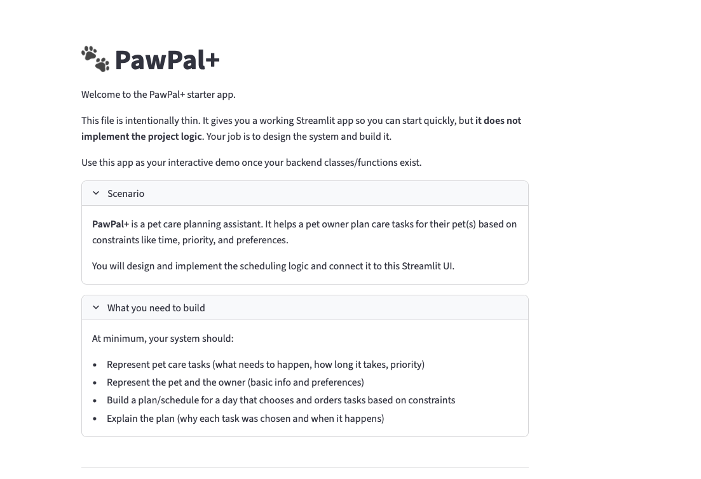
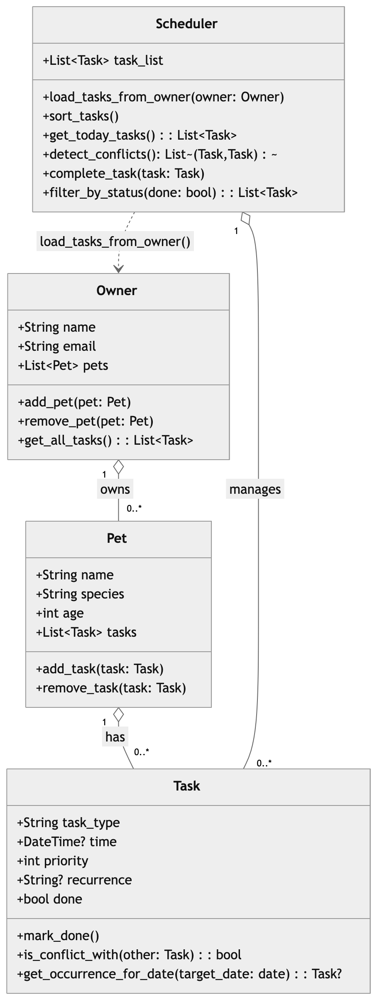

# PawPal+ (Module 2 Project)

You are building **PawPal+**, a Streamlit app that helps a pet owner plan care tasks for their pet.

## Scenario

A busy pet owner needs help staying consistent with pet care. They want an assistant that can:

- Track pet care tasks (walks, feeding, meds, enrichment, grooming, etc.)
- Consider constraints (time available, priority, owner preferences)
- Produce a daily plan and explain why it chose that plan

Your job is to design the system first (UML), then implement the logic in Python, then connect it to the Streamlit UI.

## What you will build

Your final app should:

- Let a user enter basic owner + pet info
- Let a user add/edit tasks (duration + priority at minimum)
- Generate a daily schedule/plan based on constraints and priorities
- Display the plan clearly (and ideally explain the reasoning)
- Include tests for the most important scheduling behaviors

## Getting started

### Setup

```bash
python -m venv .venv
source .venv/bin/activate  # Windows: .venv\Scripts\activate
pip install -r requirements.txt
```

### Suggested workflow

1. Read the scenario carefully and identify requirements and edge cases.
2. Draft a UML diagram (classes, attributes, methods, relationships).
3. Convert UML into Python class stubs (no logic yet).
4. Implement scheduling logic in small increments.
5. Add tests to verify key behaviors.
6. Connect your logic to the Streamlit UI in `app.py`.
7. Refine UML so it matches what you actually built.


PawPal+ 🐾

PawPal+ is a smart pet care management system that helps busy pet owners plan, organize, and track care tasks for their pets. It ensures pets stay happy, healthy, and on schedule.

Features
Add owners and pets
Add, edit, and track pet care tasks (walks, feeding, medication, grooming, enrichment, etc.)
Assign priorities and durations to tasks
Recurring tasks: daily or weekly scheduling
Generate a daily plan based on priorities and constraints
Detect conflicts if two tasks overlap in time
Sort tasks by time and priority
Filter tasks by completion status
Streamlit UI for a simple, interactive experience
CLI-first workflow for testing and debugging
Automated test suite to verify key behaviors


Project Structure
pawpal/
│
├─ pawpal_system.py      # Core classes: Task, Pet, Owner, Scheduler
├─ main.py               # CLI demo and testing
├─ app.py                # Streamlit UI
├─ tests/
│   └─ test_pawpal.py    # Automated test suite
├─ uml_final.png          # Final UML diagram
├─ requirements.txt
└─ README.md

Testing PawPal+

Runs all automated tests to verify the system behaves correctly:

python -m pytest


Smarter Scheduling Section from Phase 4:


Tasks are sorted by time and priority
Daily and weekly recurring tasks automatically reappear after completion
Conflict detection warns the user about overlapping tasks
Filter tasks by completion status for a clean view


Screenshots:

My Streamlit app in action:



