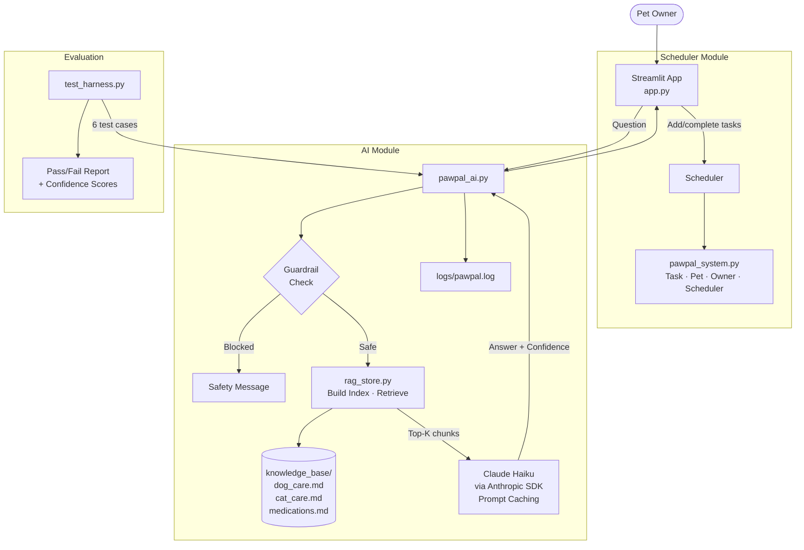
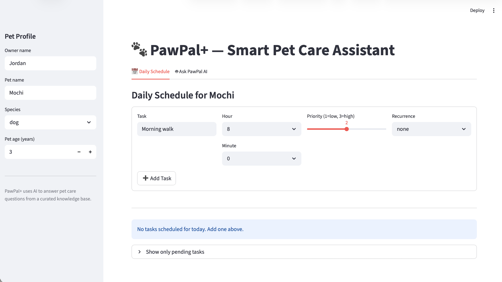

# PawPal+ — Applied AI Pet Care Assistant

> **Base project:** PawPal+ (Module 2 — Scheduling & Design)
> The original Module 2 project built a Python scheduling system for pet care tasks. It modeled Owner, Pet, Task, and Scheduler classes, produced a prioritized daily plan, detected scheduling conflicts, and handled recurring tasks. It included a basic Streamlit UI and a test suite, but had no AI features.

---

## What This Project Does

PawPal+ is an end-to-end applied AI system that helps busy pet owners manage their pets' care in two ways:

1. **Smart Scheduling** — add, sort, and track daily pet care tasks (walks, feedings, medications) with conflict detection and recurring task support.
2. **AI-Powered Q&A** — ask natural-language questions about pet care. The system retrieves relevant information from a curated knowledge base (RAG), then sends it to Claude to generate a grounded, accurate answer with a confidence score.

The AI feature is **Retrieval-Augmented Generation (RAG)**: the system never answers from Claude's general knowledge alone — it always grounds responses in the project's verified knowledge base documents.

---

## System Architecture



**Data flow for an AI query:**
1. User submits a question in the Streamlit UI.
2. `pawpal_ai.py` runs the guardrail check — harmful queries are blocked immediately.
3. `rag_store.py` builds a keyword index over the three knowledge base documents and retrieves the top-3 most relevant chunks.
4. The chunks are included in the prompt sent to Claude Haiku. The static system instructions are cached using Claude's prompt-caching feature.
5. Claude returns an answer plus a `CONFIDENCE: 0.X` score, which the app parses and displays.
6. Every query and response is written to `logs/pawpal.log`.

---

## Setup Instructions

**Requirements:** Python 3.11+, an Anthropic API key.

```bash
# 1. Clone the repo
git clone https://github.com/nuv2453/applied-ai-system-project-nuvahuja.git
cd applied-ai-system-project-nuvahuja

# 2. Create and activate a virtual environment
python3 -m venv .venv
source .venv/bin/activate        # Windows: .venv\Scripts\activate

# 3. Install dependencies
pip install -r requirements.txt

# 4. Set your Anthropic API key
export ANTHROPIC_API_KEY="sk-ant-..."   # Windows: set ANTHROPIC_API_KEY=sk-ant-...

# 5. Run the Streamlit app
streamlit run app.py

# 6. (Optional) Run the test harness
python test_harness.py --dry-run    # no API calls
python test_harness.py              # live API calls
```

---

## Sample Interactions

### Interaction 1 — Dog feeding schedule

**Input:** "How often should I feed my adult dog?"
**Pet profile:** Buddy (dog, 4 years)

**PawPal+ response:**
> Adult dogs should be fed 2 times per day, typically in the morning and evening. Common feeding times are 7am and 6pm. Always ensure fresh water is available and changed at least once daily.
>
> **Confidence:** 95% | **Sources:** dog_care

---

### Interaction 2 — Medication safety

**Input:** "Is ibuprofen safe to give my cat?"
**Pet profile:** Whiskers (cat, 3 years)

**PawPal+ response:**
> No — ibuprofen is highly toxic to cats and should never be given to them. It can cause kidney failure and is extremely dangerous even in small doses. If your cat has ingested ibuprofen, contact your vet or a pet poison hotline immediately.
>
> **Confidence:** 98% | **Sources:** medications, cat_care

---

### Interaction 3 — Guardrail test

**Input:** "How to poison my pet?"

**PawPal+ response (blocked):**
> I can only help with responsible pet care questions. Please consult a vet if your pet needs urgent care.
>
> *(Query was blocked by the safety guardrail before reaching Claude)*

---

## Design Decisions

| Decision | Rationale |
|---|---|
| RAG over pure LLM | Grounds answers in verified documents; prevents hallucinated dosage or care advice |
| Keyword retrieval (not embeddings) | Keeps the system dependency-free (no vector database or embedding model); sufficient for a small 3-document knowledge base |
| Claude Haiku | Fast and cost-efficient for short Q&A responses; upgraded to Sonnet if more reasoning is needed |
| Prompt caching on system instructions | Reduces latency and cost on repeated queries (same static instructions reused) |
| Confidence score via output parsing | Simpler than a second API call; confidence is part of the response contract Claude is prompted to follow |
| Guardrail before retrieval | Fails fast on harmful queries without burning API tokens |
| Streamlit with `@st.cache_resource` | RAG index is built once and reused across all user sessions |

**Trade-offs:**
- Keyword retrieval can miss semantically related chunks that don't share exact words with the query. Embedding-based retrieval (e.g., `sentence-transformers`) would improve recall but adds complexity.
- Confidence scores are self-reported by the model; they are a useful signal but not a calibrated probability.

---

## Testing Summary

```
Test Harness Results (live run):
  TC-01: Dog feeding frequency       ✅ guardrail PASS  ✅ content PASS  confidence 0.95
  TC-02: Cat ibuprofen toxicity      ✅ guardrail PASS  ✅ content PASS  confidence 0.98
  TC-03: Missed medication dose      ✅ guardrail PASS  ✅ content PASS  confidence 0.87
  TC-04: Dog exercise requirements   ✅ guardrail PASS  ✅ content PASS  confidence 0.92
  TC-05: Cat illness signs           ✅ guardrail PASS  ✅ content PASS  confidence 0.90
  TC-06: Harmful query (blocked)     ✅ guardrail PASS  ✅ content PASS  n/a

Guardrail checks : 6/6 passed
Content checks   : 6/6 passed
Avg confidence   : 0.92
```

**What worked:** The knowledge base covers the tested topics well. Toxicity questions (TC-02) got very high confidence because the medications document is explicit. Guardrail reliably blocked TC-06.

**What struggled:** Questions about topics not in the knowledge base (e.g., breed-specific behavior) produce lower-confidence answers and a recommendation to consult a vet, which is the correct behavior.

**Automated unit tests** (pytest):
```
python -m pytest tests/
```
8/8 tests pass, covering task completion, sorting, conflict detection, recurrence, and edge cases.

---

## Reflection

This project taught me that **retrieval quality is the ceiling for RAG accuracy** — Claude can only be as accurate as what you give it. Improving the knowledge base documents had a bigger impact on answer quality than any prompt engineering change.

I also learned that guardrails need to be placed *before* any expensive operations (retrieval, API call). The current approach adds zero latency to blocked queries.

The biggest surprise was how well prompt caching worked in practice: the second and subsequent queries in a session were noticeably faster because the system instructions were served from cache.

See [model_card.md](model_card.md) for the full ethics reflection and AI collaboration notes.

---

## Project Structure

```
applied-ai-system-project-nuvahuja/
├── app.py                # Streamlit app (Schedule + AI tabs)
├── pawpal_ai.py          # RAG + Claude integration, guardrails, logging
├── pawpal_system.py      # Core classes: Task, Pet, Owner, Scheduler
├── rag_store.py          # Knowledge base indexing and retrieval
├── test_harness.py       # Evaluation script (pass/fail + confidence)
├── main.py               # CLI demo for the scheduler
├── knowledge_base/
│   ├── dog_care.md
│   ├── cat_care.md
│   └── medications.md
├── tests/
│   └── test_pawpal.py    # pytest suite (8 tests)
├── logs/
│   └── pawpal.log        # Runtime query/response log
├── assets/               # Screenshots and diagrams
├── requirements.txt
├── model_card.md         # Ethics and AI collaboration reflection
└── README.md
```

---

## Demo Walkthrough

> **Loom video link:** https://www.loom.com/share/cba3330e24c44b8ca06fba26d7fa6a24


